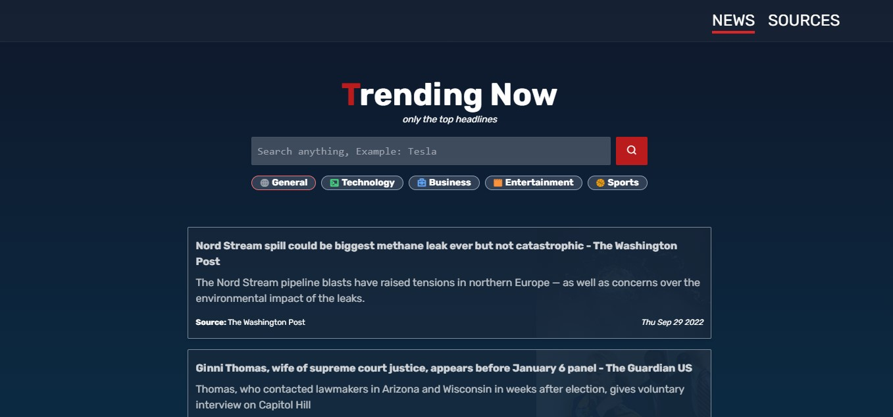

Trending now page 📰 
=============

## Overview

**Trending now page** is a website to read the most revealing news so far and get a directory of sources about news.




On this website, you can: 
- Filter news by categories (Ex: sport, business, etc).
 - Read news (is obviously).
- Has an almanac of sources about news.

## Tech

This website was created with:

- NextJS
- React
- Tailwind CSS
- News API, ***<a href="http://newsapi.org/">here.</a>***

## Setup

You want to run the project on your PC:
- clone and install the project.

- create your own API key,  ***<a href="http://newsapi.org/">here.</a>*** 

- create ```.env.local``` file in root folder.

- Put this environment variable:
```
NEXT_PUBLIC_API_KEY=YOUR_PUBLIC_API_KEY
NEXT_PUBLIC_API_URL=https://newsapi.org/v2
```

----
<div style="text-align:center;">
 <strong>Sami⚡</strong>
</div>
